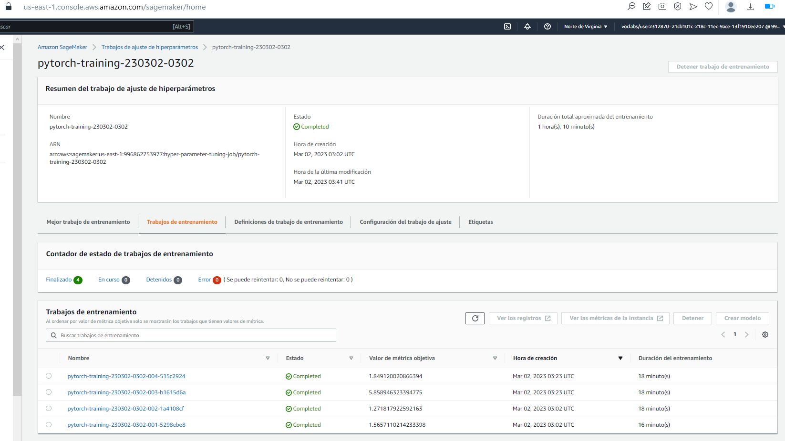
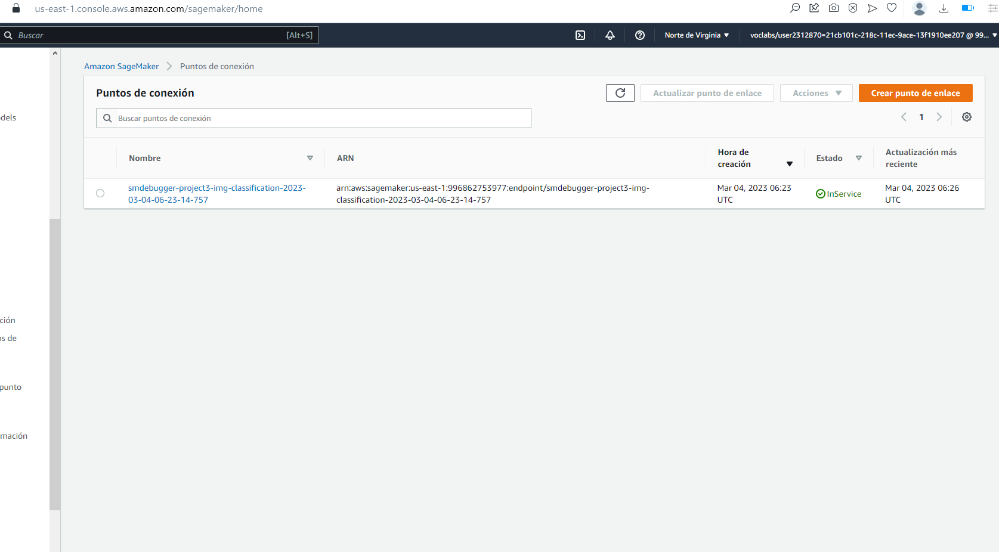

# Image Classification using AWS SageMaker

Use AWS Sagemaker to train a pretrained model that can perform image classification by using the Sagemaker profiling, debugger, hyperparameter tuning and other good ML engineering practices. This can be done on either the provided dog breed classication data set or one of your choice.

## Project Set Up and Installation
Enter AWS through the gateway in the course and open SageMaker Studio. 
Download the starter files.
Download/Make the dataset available. 

## Dataset
The provided dataset is the dogbreed classification dataset which can be found in the classroom.
The project is designed to be dataset independent so if there is a dataset that is more interesting or relevant to your work, you are welcome to use it to complete the project.

### Access
Upload the data to an S3 bucket through the AWS Gateway so that SageMaker has access to the data. 
- The dataset was uploaded to 's3://lucialedezmadlproject/DogImages'

## Hyperparameter Tuning
What kind of model did you choose for this experiment and why? Give an overview of the types of parameters and their ranges used for the hyperparameter search

I used resnet50, because this net is a CNN for image classification trained on a very large dataset, so I think this is going to have good results in classification task.
The hyperparameters I have finetuned was:
    - lr: Learning rate with the range value of (0.001, 0.1),
    - batch-size:  trained with the values 32, 64 and 128,

- Screenshot of completed training jobs:
    
- Logs metrics during the training process: path -> hypt_logs/
- Tune at least two hyperparameters: Learning rate and batch_size were tuned
- The best hyperparameters from all training jobs:
     -- 
     'batch-size': '"64"'
     'lr': '0.0027988564042975396'
     
## Debugging and Profiling

In order to understand how the model was training and its performance while this process, I have stablished the rules that includes the control of overfitting, overtraining.., I have stablished the debugger hook config with a regular expression to detect the output of the model loss, and setting the times to check it into the different phases , 
Finally I added profiler_config to check the resources usage.
All this configuartions were used into estimator istantiation; once it was created, the model was trained.

### Results

- The results I got in the debugging the model were the behaviuor of loss in the different phases like train, test and validation. These results   were useful to understand how well the model was created.
  - The conclusion of these results were:
    -- In this case, I only observe the shorter line of validation, but it is correspond to that its size is lower than the others.
    -- If is suppoused that the loss error in testing phase increase, that mean the model is probably overfitted or underfitted, so changuing          the number of epoch or increasing the dataset this situation could be better.
    -- If the loss in training phase decrease and in the validation phase decrease too, but in the test phase this error is large, the model is        overfitted too, we have to change the number of epochs or learning rate turning some of then lower, or give more variety of data in              training or validation phase, so the model could generalize better.
    
 - The results I got in profiling process were information that report the CPU, GPU, and Memory utilization; rules summary, bottleneck troubles, etc.

 - path to profiler-report.html: ProfilerReport/profiler-output/profiler-report.html
 
## Model Deployment

In order to deploy the model, yon have to use the deploy method of the PyTorch estimator, an endpoint is going to be deployed and you can check it by opening in inferences -> endpoints in sagemaker. 
Once the endpoint is available you can query it by loading an image as numpy.array format and use it to predict method of predictor object:

'''
from train_model import create_data_loaders

test_loader = create_data_loaders('dogImages/test', 4)
image_loader = None
for images,labels in test_loader:
    break 

inference = predictor.predict(images)
'''
#### Endpoint
- 
## Standout Suggestions
**TODO (Optional):** This is where you can provide information about any standout suggestions that you have attempted.